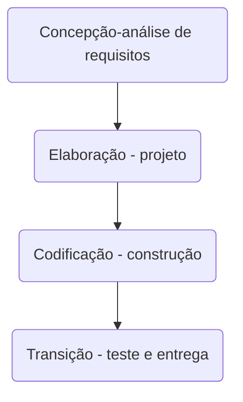
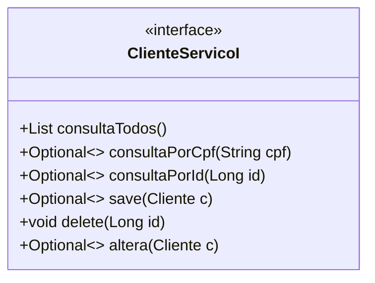
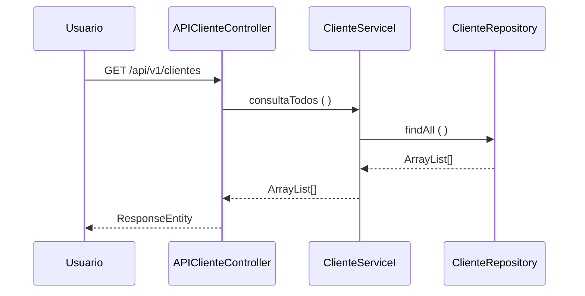

# Les Mustaches Barbearia

### Projeto Interdisciplinar - Sistema Integrado de Gestão
##### Disciplina - Programação Web III
**Grupo 1**   
Bruna Ciriaco Benedito 
Fernanda Gonçalves de Lima 
Flavia Correa de Moraes Cacau Alves 
Luis Gustavo Baia Alves 
Vicente Santos Gonçalves 

#### O que é a Les Mustaches Barbearia?
> A Les Mustaches Barbearia nasce da necessidade de um público, majoritariamente masculino, que busca o melhor serviço, conforto, produtos e comodidades na hora de cortar o cabelo, cuidar da barba ou de cuidados para dias especiais.
> Desta maneira, a Les Mustaches Barberia tem o foco nos seguintes públicos:

- Pessoas que desejam cuidados específicos para cabelo, barba e rosto;
- Pais que desejam levar seus filhos para o primeiro corte em uma barbearia profissional e criar vínculos com eles;
- Mulheres que desejam fazer cortes curtos específicos que salões tradicionais não tem o hábito ou conhecimento de como fazer;
- Pessoas que deseja realizar tratamento completo para uma data especial.

##### Identificação de Requisitos
> Durante as atividades deste trabalho foram identificadas algumas necessidades em particular para este projeto, como: Criar, Ler, Alterar e Deletar (CRUD) Clientes, Profissionais, Produtos e Serviços Prestados, além das funções internas da própria empresa como compras, estoque, horários, envios, controle de pedidos realizados. Desta maneira, os requisitos funcionais deste projeot são:

| Requisito | Descrição | Nível (A/B/C) |
|-----------|-----------|---------------|
| RF01 | Cliente e Profissional podem cadastrar, ler e alterar seu perfil | A
| RF02 | Profissional pode deletar Cliente | A |
| RF03 | Cliente pode realizar e agendar compras e serviços pelo site | M |
| RF04 | Profissional pode disponibilizar horários e serviços pelo site | A |
| RF05 | Cliente e Profissional podem realizar compras pelo site | M |

> E as regras de Negócios identificados foram:

| Regra | Descrição | Nível (A/B/C) |
|-------|-----------|---------------|
| RN01 | O cliente pode escolher se deseja retirar o produto no salão ou receber em casa | M |
| RN02 | O cliente pode ter 10% de desconto no pagamento a vista em serviços ou compras de produtos | M |
| RN03 | O cliente pode ter 5% de desconto ao realizar serviços às Terças, Quartas e Quintas | B | RN04 | O cliente pode escolher previamente quais produtos deseja usar no serviço a ser prestado e pagá-los online ou na hora | A |
| RN05 | Os descontos dados ao clientes não são cumulativos, prevalecendo somente o maior desconto | M |

##### Banco de dados

> Com os levantamentos realizados para a compreensão do que é necessário para o funcionamento da Les Mustaches Barbearia, foi realizada a Modelagem Conceitual do Banco de Dados para saber quais são as tabelas existentes para, então depois, criá-las em NoSQL no formato JSON.

##### Prototipação IHC
> O design do site foi baseado no minimalismo, pensado na forma de simplificar a navegação e a busca do cliente em nosso site pelos serviços, produtos e profissionais desejados.

Tela de Login.

Home Page.

> As telas de Cliente, Profissional, Produtos e Serviços estão em desenvolvimento.

##### Processo de Desenvolvimento de Software - PDS
> O PDS segue uma abordagem interativa incremental. Cada atividade da interação tem uma definição de pronto estabelecida com objetivo de controlar a qualidade. 

- 1 - Concepção – visão aproximada, casos de uso de negócio, escopo e estimativas vagas (fase de estudo de viabilidade)
- 2 - Elaboração – visão refinada, a arquitetura central é iterativamente implementada e os problemas de alto risco são mitigados, identificação da maioria dos requisitos e do escopo e estimativas mais realistas.
O projeto de software é iniciado logo que os requisitos de software tenham sido analisados e modelados e prepara a equipe para a transição entre a análise e o código. O projeto arquitetural define os relacionamentos entre os principais elementos estruturais do software (PRESSMAN, 6ed. p. 187). O projeto arquitetural pode ser apresentado na forma de múltiplas perspectivas. Krutchen (1995) sugere 4 visões: visão lógica, visão de implementação, visão de processo e visão de instalação. Adicionalmente as 4 visões existe os cenários que determinam a dinâmica e o comportamento da aplicação. Cada cenário descreve como os varios componentes arquiteturais colaboram para manipular uma operação de sistema. 
- 3 - Construção – mapeamento do projeto para o código, implementação iterativa dos elementos restantes de menor risco e preparação para implantação. 
- 4 - Transição – beta testes e implantação 

> A definição de "pronto" estabelece como a qualidade será atingida

| Fase | Definição de pronto estabelecida para cada fase - critério de aceitação |
| ------------ | ------------------------------------------------------------------------ |
| Concepção | No inicio da interação a equipe se reúne para garantir que existe um entendimento comum entre os envolvidos sobre o comportamento do software. Esta atividade será considerada concluída quando os exemplos de uso são discutidos e existe um "de acordo" no entedimento. Os requisitos serão documentados utilizando "estórias de usuário". Os requisitos serão priorizados (alto, médio ou baixo) de acordo com a complexidade para o desenvolvimento (funções mais complexas são mais sujeitas a falhas) e o perfil operacional de uso (funções mais utilizadas tem um impacto alto na falha). Exemplos de uso da aplicação servem como base na especificação dos casos de teste. | 
| Elaboração | Esta atividade será considerada concluída quando o Diagrama de Classes de Dominio (DCD) (LARMAN, 2006) e um esboço da visão lógica da arquitetura (KRUTCHEN, 2005) for definido e uma análise de rastreabilidade entre o DCD e o documento de requisitos não identificarem inconsistências  |
| Codificação |Será considerada concluída quando a análise de rastreabilidade entre o código e as funções solicitadas no documento de requisitos não identificarem inconsistências   |
| Teste | Será considerada concluída quando 100% dos casos de teste prioritários (complexidade, funções mais utilizadas) rastreáveis para os requisitos obtiverem satisfatório   |

##### Estudo de Caso - SIG de Vendas e Suprimentos
##### Concepção - análise de requisitos

> Considere que uma organização está iniciando um projeto para implantar um Sistema Integrado de Gestão de Vendas e Suprimentos. 
Os seguintes requisitos foram identificados na primeira reunião com o cliente (RU – Requisito de Usuário). 

- RU01 - Compras - Registra e acompanha os processos de compras na organização, prevê a entrega programada de pedidos de compra
- RU02 - Recebimento - Registra, controla e informa sobre a entrada de mercadorias e integra as informações dos dados da nota fiscal de entrada com o estoque 
- RU03 - Vendas – Registra e acompanha as vendas mantendo as informações integradas com o controle de estoque. 

> Cada requisito tem um identificador único de maneira que seja possível rastrear a necessidade do cliente com a implementação do software. A prioridade é estabelecida considerando o risco de falha. Quanto mais complexa uma função maior é o risco de falha (alto, médio ou baixo). Perfil operacional de uso - quanto mais utilizada for uma função maior será o impacto em uma falha.

| Identificador | Descrição | Prioridade |
| ------------ | ------------------------------------------------------------------------ | ------| 
| REQ01 – cadastrar cliente | Como – vendedor, Eu quero – cadastrar o cliente, De maneira que – seja possível identificar o cliente e o endereço de entrega para confirmar uma venda| Média |
| REQ02 – consultar cliente por ID| Como – vendedor, Eu quero – consultar um cliente pelo ID, De maneira que – seja possível obter informações detalhas do cliente | Alta |
| REQ03 – consultar cliente por CPF | Como – vendedor, Eu quero – consultar um cliente, De maneira que – seja possível obter informações detalhas do cliente | Alta |
| REQ04 – consultar todos os clientes | Como – vendedor, Eu quero – consultar todos os clientes cadastrado, De maneira que – seja possível obter uma lista de clientes | Baixa |
| REQ05 – corrigir informações de cliente | Como – vendedor, Eu quero – corrigir as informações do cliente, De maneira que – seja possível manter as informações atualizadas | Baixa |
| REQ06 – excluir cliente | Como – vendedor, Eu quero – excluir um cliente, De maneira que – seja possível manter informações somente de clientes ativos | Baixa |

##### Análise do comportamento
> Exemplos de uso estabelecem o comportamento esperado da aplicação. Os casos de teste (CT) são rastreaveis para os requsiitos (REQ). O elo de rastreabilidade é estabelecido pelo identificador do caso de teste.

| Identificador | Cenário de uso |
| ------------ | ------------------------------------------------------------------------ |
| REQ01CT01 | Dado (setup) que o CPF do cliente não está cadastrado; Quando (ação) o usuário confirma o cadastro; Então (resultado esperado) o sistema envia uma mensagem de cadastro realizado com sucesso |
| REQ01CT02 | Dado (setup) que o CPF do cliente está cadastrado; Quando (ação) o usuário confirma o cadastro; Então (resultado esperado) o sistema rejeita e envia uma mensagem de dados inválidos |

##### Elaboração - projeto

> As classes conceituais relacionadas aos requisitos para está interação foram identificadas no modelo de dominio. 

> Considerando requisitos de negócio que envolvem a utilização do sistema flexivel para os tipos de dispositivos de entrada (desktop, dispositivos moveis ou totens) a arquitetura segue o estilo Hexagonal  que isola o nucleo da aplicação (camada interna) da camada externa que é tudo que se comunica com a aplicação, banco de dados, serviços de e-mail e os controllers (RICHARDSON, 2018, p.38). A parte externa pode ser modificada de acordo com a necessidade melhorando a testabilidade do software considerando que as modificações na camada externa não impactam a camada interna devido ao seu isolamento. 

> A arquitetura segue uma abordagem orientada a serviços. Os serviços foram classificados em três tipos (ERL, 2007):
- **1. Serviços utilitários**. Implementam funcionalidades comuns a vários tipos de aplicações, como, por exemplo: log, notificação, transformação de informações. Um exemplo de serviço utilitário é um serviço de conversão de moeda que poderá ser acessado para calcular a conversão de uma moeda (por exemplo, dólares) para outra (por exemplo, euros).
- **2. Serviços de entidade (serviços de negócios)**. Derivado de uma ou mais entidades de negócio (domínio), possuindo um alto grau de reutilização. Geralmente são serviços que fazem operações CRUD (Create, Read, Update e Delete). 
- **3. Serviços de tarefa (coordenação de processos-workflow)**. Tipo de serviço mais específico que possui baixo grau de reuso. Consome outros serviços para atender seus consumidores. São serviços que suportam um processo de negócios amplo que geralmente envolve atividades e atores diferentes. Um exemplo de serviço de coordenação em uma empresa é um serviço de pedidos em que os pedidos são feitos, os produtos são aceitos e os pagamentos são efetuados.

> A visão lógica da arquitetura para API de Cliente é apresentada na figura abaixo. A visã lógica descreve como o código está organizado, as classes os pacotes e os relacionamentos entre eles. 

> As operações da entidade Cliente identificada no modelo de dominio do SIG-VS são especificadas como um serviço que apoia o processo de venda. O contrato das operações de sistema devem ser definidos (LARMAN, 2006, pag 140). 

> O diagrama de sequência descreve como os varios componentes arquiteturais colaboram para manipular uma operação de sistema (exemplo para operação consultaTodos())

> Referencias
- [1] KRUCHTEN, Philippe. Reference: Title: Architectural blueprints—the “4+ 1” view model of software architecture. IEEE software, v. 12, n. 6, 1995.
- [2] RICHARDSON, Chris. Microservices patterns: with examples in Java. Simon and Schuster, 2018.
- [3] ERL, Thomas. SOA principles of service design (the Prentice Hall service-oriented computing series from Thomas Erl). Prentice Hall PTR, 2007.
- [4] LARMAN, Craig. Utilizando UML e padrões. 2aed., Porto Alegre: Bookman Editora, 2006 (pag. 147).
